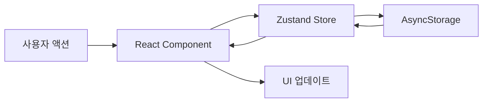
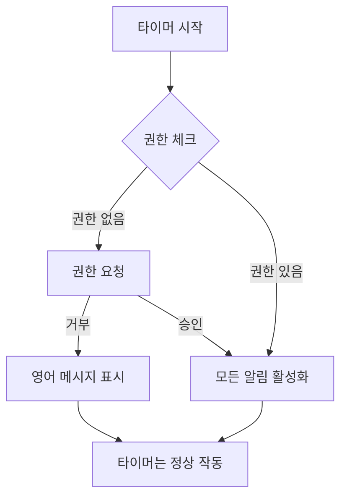

# Zen Tracker App 분석 문서

## 📅 2025년 9월 9일 작업 내용 (추가)

### 🔧 Live Activity UI 개선 및 버그 수정

#### 1. **변수명 일관성 문제 해결**
- **문제**: `targetMinutes` state 변수와 로컬 변수명 충돌로 TypeScript 에러 발생
- **해결**: 모든 로컬 변수명을 용도에 맞게 변경
  - `totalMinutes`: 시간+분 합계 계산용
  - `calculatedMinutes`: targetSeconds에서 계산된 분
  - `liveActivityMinutes`: Live Activity 전달용
  - `baseMinutes`: 재계산용 기본 분
- **영향**: Native 코드는 영향 없음 (React Native Bridge는 위치 기반 파라미터 전달)

#### 2. **Live Activity Progress Bar 제거**
- **문제**: Progress Bar와 Percentage가 실시간 업데이트 안됨
  - 타이머는 `Text(Date, style: .timer)`로 자동 업데이트
  - Progress Bar는 정적 컴포넌트로 앱이 백그라운드 시 업데이트 중단
- **해결**: Progress Bar와 Percentage 완전 제거
  - 잠금화면: Target 시간만 표시, 깃발 아이콘 제거
  - Infinity 모드: ∞ 아이콘만 표시
  - Dynamic Island: 아이콘과 텍스트 유지
- **결과**: 일관된 UX, iOS 가이드라인 준수

#### 3. **앱 강제종료 시 알림 버그 수정**
- **문제**: 타이머 실행 중 앱 강제종료 시 예약된 Push Notification이 계속 발송
- **원인**: useEffect에 cleanup 함수 없음, iOS 시스템이 예약 알림 독립적으로 관리
- **해결**: useEffect cleanup 함수 추가
  ```typescript
  return () => {
    // BackgroundTimer 정리
    if (intervalRef.current) {
      BackgroundTimer.clearBackgroundInterval(intervalRef.current)
    }
    // 모든 예약 알림 취소
    cancelAllScheduledNotifications()
    // Live Activity 종료
    if (liveActivityId) {
      LiveActivityService.endActivity(liveActivityId)
    }
  }
  ```
- **결과**: 앱 강제종료 시 모든 알림 자동 취소

#### 4. **수정된 파일 목록**
- `src/screens/TimerPage.tsx`: 변수명 통일, cleanup 함수 추가
- `ios/ZenActivityWidget/ZenActivityWidgetLiveActivity.swift`: Progress Bar 제거, UI 단순화

---

## 📅 2025년 9월 9일 작업 내용

### 🛠️ CocoaPods 및 TypeScript 에러 수정

#### 1. **CocoaPods Sandbox 동기화 문제 해결**
- **문제**: "The sandbox is not in sync with the Podfile.lock" 에러
- **해결**: `cd ios && pod install` 실행
- **결과**: 75개의 dependencies 성공적으로 설치 완료
- **경고**: @react-native-firebase 패키지 미설치 경고 (무시 가능)

#### 2. **TypeScript 컴파일 에러 수정**

**수정된 파일들:**

1. **App.tsx**
   - 제거된 NotificationService 메서드 참조 정리
   - `isTestReminderScheduled`, `scheduleTestReminder`, `cancelTestReminder` 관련 코드 주석 처리
   - 테스트 모드 알림 코드 비활성화

2. **src/services/BackgroundTimer.ts**
   - 하위 호환성을 위한 alias 메서드 추가
   ```typescript
   setInterval(callback: () => void, ms: number): string {
     return this.setBackgroundInterval(callback, ms);
   }
   
   clearInterval(id: string) {
     this.clearBackgroundInterval(id);
   }
   ```

3. **src/features/timer/hooks/useTimer.ts**
   - interval 타입 수정: `number` → `string`
   - BackgroundTimer 서비스의 반환 타입과 일치시킴

4. **src/screens/TimerPage.tsx**
   - 변수명 충돌 해결: `targetMinutes` → `targetMins`
   - 재귀 참조 에러 방지

5. **src/store/store.ts**
   - reduce 함수 타입 명시: `reduce<Session | null>`
   - TypeScript 타입 추론 문제 해결
   - 두 곳 모두 수정 (replace_all 사용)

6. **src/services/AnalyticsService.ts**
   - Firebase Analytics 임시 비활성화 (패키지 미설치 상태)
   - Mock 함수로 대체하여 빌드 에러 방지
   ```typescript
   const analytics = () => ({
     logEvent: async (eventName: string, params?: any) => {},
     logScreenView: async (params: any) => {},
     setUserProperty: async (name: string, value: string) => {},
   })
   ```

#### 3. **iOS Native 코드 수정**

**AppDelegate.mm**
- Firebase 관련 import 및 초기화 코드 제거
- `#import <Firebase.h>` → 주석 처리
- `[FIRApp configure]` → 주석 처리
- Firebase 패키지 미설치 상태이므로 관련 코드 비활성화

#### 4. **현재 상태**
- ✅ CocoaPods 동기화 완료
- ✅ TypeScript 컴파일 에러 모두 해결  
- ✅ iOS Native 코드 Firebase 에러 해결
- ✅ 프로젝트 빌드 가능 상태
- ✅ Firebase는 나중에 패키지 설치 후 활성화 가능

---

## 📅 2025년 1월 3일 작업 내용

### 🎯 Live Activity 실시간 동기화 문제 해결
FitiRun 프로젝트의 Live Activity 구현을 참고하여 실시간 동기화 문제 완전 해결

#### 1. **Live Activity 실시간 타이머 구현**
- **문제**: Pause 상태는 동기화되지만 타이머가 실시간으로 업데이트되지 않음
- **원인**: Timer.publish와 computed property는 Live Activity에서 작동하지 않음
- **해결**: `Text(Date, style: .timer)` 사용
  ```swift
  // 일시정지 시: 정적 시간 표시
  if context.state.isPaused {
      Text(formatTime(seconds: context.state.elapsedSeconds))
  } else {
      // 실행 중: 실시간 타이머
      let adjustedStart = context.attributes.startTime.addingTimeInterval(context.state.pausedDuration)
      Text(adjustedStart, style: .timer)
  }
  ```

#### 2. **Pause/Resume 동기화**
- **pausedDuration 계산 로직 수정** (LiveActivityModule.swift)
  - Pause 시: `totalElapsed - currentSeconds`로 계산
  - Resume 시: 기존 pausedDuration 유지
- **TimerPage.tsx 수정**
  - Pause 중에는 frozen elapsed time 사용
  - Resume 시 정확한 시점부터 재개

#### 3. **Push Notification 일시정지 동기화**
- **문제**: 일시정지해도 Push Notification이 예약된 시간에 도착
- **해결**: 
  - Pause 시: 모든 예약된 알림 취소
  - Resume 시: 남은 시간 기준으로 재예약
  - 새로운 헬퍼 함수: `scheduleNotificationWithDelay()`

#### 4. **Infinity 모드 Live Activity 수정**
- **문제**: targetSeconds가 0일 때 Live Activity가 시작되지 않음
- **원인**: `if (activity && targetSeconds > 0)` 조건
- **해결**: 조건 제거, infinity 모드도 Live Activity 지원

### 📝 수정된 파일 목록

#### iOS Native (Swift/Objective-C)
1. **ios/ZenApp/LiveActivityModule.swift**
   - pausedDuration 계산 로직 개선
   - 상태 변경 감지 로그 추가

2. **ios/ZenActivityWidget/ZenActivityWidgetLiveActivity.swift**
   - Text(Date, style: .timer) 구현
   - Dynamic Island, Compact, Lock Screen 뷰 수정
   - 불필요한 Timer.publish 제거

3. **ios/ZenActivityWidget/ZenActivityAttributes.swift**
   - lastUpdateTime, pausedDuration 필드 유지

4. **중복 파일 정리**
   - ios/LiveActivityModule.* 파일들 제거 (중복)
   - ios/ZenApp/ 폴더의 파일만 사용

#### JavaScript/TypeScript
1. **src/screens/TimerPage.tsx**
   - handlePause: 알림 취소 로직 추가
   - handleResume: 알림 재예약 로직 추가
   - Infinity 모드 Live Activity 조건 수정
   - Pause 시 elapsed time freeze 처리

2. **src/services/notifications/NotificationService.ts**
   - scheduleNotificationWithDelay() 메서드 추가

3. **src/hooks/useNotifications.ts**
   - scheduleNotificationWithDelay export 추가

### 🎨 Live Activity 디자인 수정 가이드

#### 잠금화면 Live Activity 디자인을 수정하려면:

**📍 메인 파일: `/ios/ZenActivityWidget/ZenActivityWidgetLiveActivity.swift`**

```swift
// 주요 컴포넌트 구조:
1. LockScreenLiveActivityView (Line 81-148)
   - 잠금화면에 표시되는 메인 뷰
   - Header: 타이머 아이콘, 활동명, PAUSED 상태
   - Timer Display: 큰 시간 표시 (42pt)
   - Progress Bar: 목표 진행률
   - Infinity Mode: "No target set" 표시

2. DynamicIslandExpandedRegion (Line 23-58)
   - Dynamic Island 확장 뷰
   - Leading: 활동명
   - Trailing: 시간
   - Center: PAUSED 상태
   - Bottom: 진행률 바

3. Compact Mode (Line 59-73)
   - Dynamic Island 축소 뷰
   - Leading: 아이콘
   - Trailing: 시간 (간략)
```

**🎨 디자인 요소 수정 위치:**
- **색상**: `.foregroundColor()`, `.tint()` 
  - 현재: orange (#FFA500)
  - Gray for paused state
- **폰트**: `.font()` 
  - Timer: `.system(size: 42, weight: .bold, design: .monospaced)`
  - Headers: `.headline`, `.caption`
- **아이콘**: `Image(systemName:)`
  - timer, pause.circle.fill, infinity
- **레이아웃**: `VStack`, `HStack`, `spacing`
- **배경**: `.activityBackgroundTint()`

**💡 수정 예시:**
```swift
// 색상 변경
.foregroundColor(.orange) → .foregroundColor(.blue)

// 폰트 크기 변경  
.font(.system(size: 42, ...)) → .font(.system(size: 48, ...))

// 아이콘 변경
Image(systemName: "timer") → Image(systemName: "clock.fill")

// 배경색 변경
.activityBackgroundTint(Color.black.opacity(0.5)) 
→ .activityBackgroundTint(Color.purple.opacity(0.3))
```

### 📅 추가 작업 내용 (2025년 1월 3일 오후)

#### 5. **Push Notification 일시정지/재개 동기화**
- **구현 방식**: 
  - Pause 시: 모든 예약된 알림 취소
  - Resume 시: 남은 시간 기준으로 재예약
- **새로운 함수**: `scheduleNotificationWithDelay()`
- **영향받는 알림**: Goal, 2x Target, Check-in, Hourly

#### 6. **Infinity 모드 Live Activity 지원**
- **문제**: `targetSeconds > 0` 조건으로 infinity 모드에서 Live Activity 미작동
- **해결**: 조건 제거, targetMinutes = 0 전달
- **결과**: Infinity 모드에서도 Live Activity 표시

#### 7. **Live Activity 아이콘 변경**
- **PNG 이미지 시도**: Widget Extension 번들 설정 복잡으로 실패
- **최종 선택**: SF Symbol `timer.circle.fill` 사용
- **Dynamic Island**: 일시정지 시 `pause.circle.fill` 표시

#### 8. **Progress Bar 실시간 업데이트 분석**
- **제한사항**: Live Activity에서 ProgressView는 정적 (실시간 업데이트 불가)
- **실시간 가능**: `Text(Date, style: .timer)`만 자동 업데이트
- **현재 방식**: 1초마다 앱에서 업데이트 전송

### ✅ 현재 상태
- Live Activity 실시간 동기화 ✅
- Pause/Resume 완벽 동작 ✅
- Push Notification 일시정지 동기화 ✅
- Infinity 모드 지원 ✅
- 모든 파일 정리 및 중복 제거 ✅
- SF Symbol 아이콘 적용 ✅

# Zen Tracker App 분석 문서

## 앱 개요
Zen Tracker는 사용자가 다양한 활동(읽기, 명상, 쓰기, 운동 등)에 집중한 시간을 추적하는 React Native 앱입니다. 사용자는 활동을 선택하고, 타이머를 시작하여 집중 시간을 기록하며, 일/주/월/년 단위로 통계를 확인할 수 있습니다.

## 기술 스택
- **프레임워크**: React Native (Expo)
- **상태 관리**: Zustand
- **내비게이션**: React Navigation
- **데이터 저장**: AsyncStorage (로컬 저장소)
- **주요 라이브러리**: 
  - date-fns (날짜 처리)
  - react-native-svg (차트 그래픽)
  - react-native-draggable-flatlist (드래그 앤 드롭)
  - react-native-circular-progress (원형 진행률)

## 앱 플로우차트


## 데이터베이스 구조 및 연동

### 데이터 저장 방식
이 앱은 **외부 데이터베이스를 사용하지 않고** AsyncStorage를 통한 **로컬 저장소**만 사용합니다. 모든 데이터는 디바이스에 로컬로 저장됩니다.

### 데이터 모델

#### 1. Activity (활동)
```typescript
interface Activity {
  id: string              // 고유 ID (timestamp + random)
  name: string           // 활동명
  totalTime: number      // 총 누적 시간 (밀리초)
  lastUsed: Date        // 마지막 사용 시간
  color?: string        // 활동 색상 (선택사항)
  order?: number        // 표시 순서
  sessions?: Session[]  // 세션 목록 (선택사항)
  lastTargetHours?: number    // 마지막 목표 시간
  lastTargetMinutes?: number  // 마지막 목표 분
}
```

#### 2. Session (세션)
```typescript
interface Session {
  id: string             // 세션 ID
  activityId: string     // 연결된 활동 ID
  startTime: Date       // 시작 시간
  endTime?: Date        // 종료 시간
  duration: number      // 지속 시간 (밀리초)
  pauses: Array<{       // 일시정지 기록
    start: Date
    end?: Date  
  }>
  targetDuration?: number // 목표 시간 (밀리초)
}
```

### 상태 관리 (Zustand Store)

#### 주요 상태
- `activities`: 모든 활동 목록
- `sessions`: 모든 세션 기록
- `currentSession`: 현재 진행 중인 세션
- `isFirstTime`: 첫 실행 여부
- `selectedActivities`: 선택된 활동 목록

#### 주요 액션
- `addActivity`: 새 활동 추가
- `removeActivity`: 활동 삭제
- `updateActivity`: 활동 정보 업데이트
- `reorderActivities`: 활동 순서 변경
- `startSession`: 세션 시작
- `pauseSession`: 세션 일시정지
- `resumeSession`: 세션 재개
- `endSession`: 세션 종료

### 데이터 영속성
Zustand의 `persist` 미들웨어를 사용하여 AsyncStorage에 자동으로 저장:
```javascript
persist(
  (set, get) => ({ ... }),
  {
    name: 'zen-storage',  // 저장소 키
    storage: createJSONStorage(() => AsyncStorage)
  }
)
```

## 주요 화면 및 기능

### 1. 온보딩 페이지 (OnboardingPage)
- **첫 실행 시** 표시
- 기본 활동 6개 제공 (읽기, 명상, 쓰기, 운동, 공부, 일)
- 사용자 정의 활동 추가 가능
- 선택된 활동들을 Store에 저장

### 2. 홈 페이지 (HomePage)
- **활동 목록 표시**: 각 활동의 오늘 집중 시간 표시
- **활동 관리**: 
  - 추가: 새 활동 생성
  - 편집: 활동명 수정
  - 삭제: 활동 제거
  - 순서 변경: 드래그 앤 드롭
- **빠른 액션**: 활동 탭하여 타이머 시작

### 3. 타이머 페이지 (TimerPage)
- **목표 시간 설정**: 시간/분 선택
- **타이머 기능**:
  - 시작/일시정지/재개
  - 진행률 원형 차트 표시
  - 목표 달성 시 시각적 피드백
- **백그라운드 타이머**: BackgroundTimer 서비스로 앱이 백그라운드에서도 정확한 시간 추적

### 4. 리포트 페이지 (ReportPage)
- **기간별 통계**: 일/주/월/년 단위
- **차트 뷰**:
  - Timeline Chart: 시간대별 활동 분포
  - Rings Chart: 활동별 비율
- **통계 정보**:
  - 총 집중 시간
  - 활동별 시간 및 비율
  - 평균 집중 시간
  - 최장 세션 시간

## 백그라운드 타이머 서비스
`BackgroundTimer` 클래스는 앱이 백그라운드 상태일 때도 정확한 시간을 추적합니다:

1. **AppState 모니터링**: 앱 상태 변화 감지 (active/background)
2. **백그라운드 시간 계산**: 백그라운드 진입 시간 기록
3. **복귀 시 보정**: 포그라운드 복귀 시 놓친 인터벌 실행
4. **정확한 경과 시간**: 일시정지 시간을 제외한 실제 활동 시간 계산

## 컴포넌트 구조

### 재사용 컴포넌트
1. **OnboardingTutorial**: 첫 사용자를 위한 튜토리얼
2. **RingsChart**: 활동별 비율을 보여주는 링 차트
3. **TimelineChart**: 시간대별 활동 분포 차트

### 유틸리티
- **activityColors**: 활동별 색상 관리

## 데이터 플로우



1. **사용자 액션**: 활동 추가, 타이머 시작 등
2. **컴포넌트에서 Store 액션 호출**: `useStore` 훅 사용
3. **Store 상태 업데이트**: Zustand가 상태 변경 관리
4. **AsyncStorage 자동 저장**: persist 미들웨어가 자동 처리
5. **UI 자동 업데이트**: Store 변경 시 구독된 컴포넌트 리렌더링

## 특징 및 장점

1. **오프라인 우선**: 모든 데이터가 로컬 저장되어 인터넷 연결 불필요
2. **실시간 동기화**: Zustand의 구독 메커니즘으로 즉각적인 UI 업데이트
3. **백그라운드 정확성**: 앱이 백그라운드에서도 정확한 시간 추적
4. **간단한 구조**: 외부 데이터베이스 없이 AsyncStorage만으로 구현
5. **사용자 프라이버시**: 모든 데이터가 디바이스에만 저장

## 향후 개선 가능 사항

1. **클라우드 동기화**: 여러 디바이스 간 데이터 동기화
2. **데이터 백업/복원**: 기기 변경 시 데이터 이전
3. **상세 분석**: 더 깊이 있는 통계 및 인사이트
4. **소셜 기능**: 친구와 활동 공유, 챌린지 기능
5. **알림 기능**: 목표 달성, 리마인더 등

---

## 2025-08-28 작업 내용

### 1. iOS 버전 업데이트 (13.4 → 16.6) ✅

**완료된 작업**:
- `ios/ZenApp.xcodeproj/project.pbxproj`에서 `IPHONEOS_DEPLOYMENT_TARGET` 16.0으로 변경
- Xcode에서 minimum deployment target 16.6으로 설정
- `ios/Podfile`에서 platform 및 모든 Pods의 deployment target 16.6으로 업데이트
- Marketing Version 1.0.4로 업데이트

### 2. 로컬 푸시 알림 시스템 구현 ✅

**구현된 기능**:
1. **목표 달성 알림**: 설정한 목표 시간에 도달 시 알림
2. **체크인 알림**: 30분마다 "아직 집중 중?" 알림
3. **세션 완료 알림**: 타이머 종료 시 완료 알림

**생성/수정된 파일**:
- `src/services/notifications/NotificationService.ts`: 핵심 알림 서비스 (Singleton 패턴)
- `src/services/notifications/LiveActivityService.ts`: Live Activity 플레이스홀더 (Coming Soon)
- `src/hooks/useNotifications.ts`: React Hook for notifications
- `src/config/notifications.config.ts`: 알림 설정 상수
- `src/screens/TimerPage.tsx`: 알림 통합
- `App.tsx`: NotificationService 초기화 추가
- `ios/ZenApp/Info.plist`: 백그라운드 모드 및 알림 권한 설정 추가

### 3. 주요 문제 해결 ✅

#### A. 프로젝트 이름 복원 문제
- **문제**: `npx expo prebuild --clean` 실행 시 ZenApp이 ZenTracker로 변경됨
- **해결**: `git restore ios/`로 원래 프로젝트 복원 후 수동으로 expo-notifications 설치

#### B. Xcode 빌드 에러
1. **ExpoPushTokenManager module not found**
   - 해결: expo-notifications 0.28.19 버전 설치
   
2. **React Native header warnings**
   - 해결: Podfile에 warning suppression 설정 추가
   
3. **Dependency graph error**
   - 해결: DerivedData 삭제, `pod deintegrate && pod install`

#### C. 알림 동작 문제
1. **목표 달성 즉시 알림 문제**
   - 원인: `delaySeconds` 파라미터 미전달
   - 해결: `useNotifications.ts`에 파라미터 추가, 타이머 시작 시 예약

2. **무한 알림 반복 문제**
   - 원인: 매 초마다 알림 발송 로직 실행
   - 해결: 타이머 시작 시 한 번만 예약, 중복 체크 로직 추가

3. **잠금화면 알림 미작동**
   - 원인: NotificationHandler 미설정, 백그라운드 모드 미활성화
   - 해결: 
     - `Notifications.setNotificationHandler` 설정
     - Info.plist에 `UIBackgroundModes` 추가
     - iOS 권한 옵션 상세 설정

### 4. 현재 구조

```
알림 시스템 아키텍처:
┌─────────────────┐
│   App.tsx       │ → NotificationService 초기화
└────────┬────────┘
         │
┌────────▼────────┐
│ NotificationService │ → Singleton 패턴
│  - 권한 관리        │
│  - 알림 스케줄링    │
│  - 중복 방지        │
└────────┬────────┘
         │
┌────────▼────────┐
│ useNotifications │ → React Hook
│  - 권한 요청        │
│  - 알림 예약        │
│  - 에러 처리        │
└────────┬────────┘
         │
┌────────▼────────┐
│   TimerPage     │ → 알림 통합
│  - 시작 시 예약    │
│  - 종료 시 취소    │
│  - 상태 관리       │
└─────────────────┘
```

### 5. Pod 설정 최종 상태
- iOS Deployment Target: 16.6
- 모든 경고 억제 설정 적용
- expo-notifications 0.28.19 통합 완료

### 6. 추가 알림 기능 구현 ✅

#### A. 무한 타이머 모드 (00:00) 
- **기능**: 목표 시간 미설정 시 매 시간마다 알림
- **구현**: `scheduleHourlyNotification()` - 1시간마다 반복
- **메시지**: "⏱️ One hour passed - You've been focusing on [활동명] for an hour. Great persistence!"

#### B. 2배 목표 달성 알림
- **기능**: 설정한 목표 시간의 2배 도달 시 알림 (타이머 실행 중일 때만)
- **구현**: `scheduleDoubleTargetNotification()` - 목표 x2 시간에 발송
- **메시지**: "🔥 Double your target! - Amazing! You've been focusing on [활동명] for X minutes - that's 2x your goal!"

#### C. 세션 완료 알림 (일시 비활성화)
- **상태**: 주석 처리로 비활성화 (`TimerPage.tsx:234-237`)
- **활성화 방법**: 주석 제거

### 7. 알림 메시지 수정 가이드 📝

각 알림 유형별 메시지 수정 위치:

#### 목표 달성 알림
```typescript
// src/services/notifications/NotificationService.ts (line 99-101)
title: '🎯 Goal Achieved!',
body: `Congratulations! You've completed ${targetMinutes} minutes of ${activityName}.`,
```

#### 체크인 알림 (30분마다)
```typescript
// src/services/notifications/NotificationService.ts (line 164-165)
title: '⏱️ Still focusing?',
body: `You've been working on ${activityName} for ${intervalMinutes} minutes. Keep going!`,
```

#### 시간당 알림 (무한 모드)
```typescript
// src/services/notifications/NotificationService.ts (line 197-198)
title: '⏱️ One hour passed',
body: `You've been focusing on ${activityName} for an hour. Great persistence!`,
```

#### 2배 목표 달성 알림
```typescript
// src/services/notifications/NotificationService.ts (line 232-233)
title: '🔥 Double your target!',
body: `Amazing! You've been focusing on ${activityName} for ${doubleMinutes} minutes - that's 2x your goal!`,
```

#### 세션 완료 알림 (비활성화됨)
```typescript
// src/services/notifications/NotificationService.ts (line 268-269)
title: '✅ Session Complete',
body: `Great job! You've completed ${totalMinutes} minutes of ${activityName}.`,
```

### 8. 권한 거부 시 표시 메시지
```typescript
// src/hooks/useNotifications.ts (line 49-50)
'Notifications Disabled',
'You have declined push notifications. To receive goal achievement alerts, please enable notifications in Settings.'
```

### 9. 에러 해결 기록

#### NotificationHandler 중복 호출 문제
- **증상**: `TypeError: undefined is not a function` at App.tsx:49
- **원인**: `Notifications.setNotificationHandler` 중복 호출
  - 파일 최상위 (line 6-12)
  - initialize() 메서드 (line 39-45)
- **해결**: 중복 제거 필요

---

## 작업 실현 가능성 분석

### 1. iOS 버전 업데이트 (13.4 → 16.0+)

**현재 상태**:
- 현재 iOS Deployment Target: **13.4**
- Live Activities 최소 요구사항: **iOS 16.1+**
- Dynamic Island 지원: **iOS 16.1+** (iPhone 14 Pro 이상)

**실현 가능성**: ✅ **가능**

**필요 작업**:
1. `ios/ZenApp.xcodeproj/project.pbxproj`에서 `IPHONEOS_DEPLOYMENT_TARGET` 변경 (13.4 → 16.1)
2. Info.plist에 Live Activities 권한 추가
3. Widget Extension 타겟 추가
4. ActivityKit 프레임워크 통합

**고려사항**:
- iOS 16 미만 사용자는 앱 사용 불가 → 사용자 베이스 감소 가능성
- 대안: 조건부 컴파일로 iOS 16+ 기능만 선택적 활성화

### 2. 로컬 알림 기능 구현

**현재 상태**:
- 푸시 알림 라이브러리: **없음**
- 백그라운드 타이머: **구현됨** (BackgroundTimer.ts)

**실현 가능성**: ✅ **가능**

**구현 방법**:

#### A. 필요 패키지 설치
```bash
expo install expo-notifications
expo install expo-task-manager  # 백그라운드 작업용
```

#### B. 제안하는 폴더 구조
```
src/
├── services/
│   ├── BackgroundTimer.ts (기존)
│   ├── NotificationService.ts (신규)
│   └── LiveActivityService.ts (신규)
├── hooks/
│   ├── useNotifications.ts (신규)
│   └── useLiveActivity.ts (신규)
├── types/
│   ├── notification.types.ts (신규)
│   └── activity.types.ts (신규)
└── config/
    └── notifications.config.ts (신규)
```

#### C. 알림 시나리오 구현

##### 1. 목표 달성 알림
```typescript
// src/services/NotificationService.ts
class NotificationService {
  // 목표 시간 달성 시 알림
  async scheduleGoalAchievedNotification(activityName: string, targetTime: number) {
    await Notifications.scheduleNotificationAsync({
      content: {
        title: "🎯 목표 달성!",
        body: `${activityName} ${formatTime(targetTime)} 목표를 달성했습니다!`,
        sound: true,
        badge: 1
      },
      trigger: null // 즉시 발송
    });
  }
}
```

##### 2. 장시간 트래킹 확인 알림
```typescript
// 30분마다 체크하여 알림
async scheduleTrackingReminderNotification(activityName: string, duration: number) {
  if (duration >= 60 * 60 * 1000) { // 1시간 이상
    await Notifications.scheduleNotificationAsync({
      content: {
        title: "⏱️ 아직 집중 중이신가요?",
        body: `${activityName}을(를) ${formatTime(duration)} 동안 진행 중입니다.`,
        categoryIdentifier: 'tracking-check',
        data: { activityName, duration }
      },
      trigger: {
        seconds: 1800, // 30분 후
        repeats: true
      }
    });
  }
}
```

#### D. Live Activity 구현 (iOS 16.1+)
```typescript
// src/services/LiveActivityService.ts
import { NativeModules } from 'react-native';

class LiveActivityService {
  // iOS Native Module 브릿지 필요
  private liveActivityModule = NativeModules.LiveActivityModule;
  
  async startLiveActivity(activityData: ActivityData) {
    if (Platform.OS === 'ios' && Platform.Version >= 16.1) {
      await this.liveActivityModule.startActivity(activityData);
    }
  }
  
  async updateLiveActivity(activityId: string, data: any) {
    await this.liveActivityModule.updateActivity(activityId, data);
  }
}
```

### 권장 구현 순서

1. **Phase 1: 기본 알림 구현**
   - expo-notifications 설치
   - NotificationService 구현
   - 목표 달성 알림
   - 장시간 사용 체크 알림

2. **Phase 2: iOS 버전 업데이트**
   - Deployment Target 16.1로 변경
   - 호환성 테스트

3. **Phase 3: Live Activity 구현**
   - Native Module 작성 (Swift)
   - ActivityKit 통합
   - 잠금화면 위젯 디자인

### 주의사항

1. **권한 요청 UX**:
   - 첫 실행 시 알림 권한 요청
   - 설정 화면에서 알림 타입별 on/off 제공

2. **배터리 최적화**:
   - 과도한 백그라운드 작업 방지
   - 필요한 경우에만 알림 예약

3. **테스트 고려사항**:
   - iOS Simulator는 Live Activity 미지원
   - 실제 디바이스 테스트 필요

### 결론

두 작업 모두 **실현 가능**하며, 현재 프로젝트 구조에 잘 통합될 수 있습니다:

- **iOS 버전 업데이트**: 간단한 설정 변경으로 가능
- **로컬 알림**: Expo의 notifications 패키지로 쉽게 구현 가능
- **Live Activity**: Native Module 작성 필요하지만 구현 가능

제안된 폴더 구조는 기존 코드베이스와 일관성을 유지하면서 새 기능을 깔끔하게 추가할 수 있도록 설계되었습니다.

---

## 📱 알림 시스템 구현 (2025.08.28 추가)

### 개요
iOS 16+ 타겟으로 로컬 푸시 알림 시스템을 구현했습니다. 권한이 있을 때만 알림이 작동하며, 권한 거부 시 영어 메시지를 표시합니다.

### iOS 설정 변경
- **Deployment Target**: 13.4 → **16.0** 업그레이드
- **Marketing Version**: 1.0.3 → **1.0.4**
- **Info.plist 추가**: NSUserNotificationUsageDescription
- **Live Activity 준비**: NSSupportsLiveActivities (현재 false)

### 새로 추가된 파일 구조

```
zen-native-app/
├── src/
│   ├── services/
│   │   └── notifications/
│   │       ├── NotificationService.ts      # 핵심 알림 서비스
│   │       └── LiveActivityService.ts      # Live Activity (Coming Soon)
│   ├── hooks/
│   │   └── useNotifications.ts            # React Hook for notifications
│   └── config/
│       └── notifications.config.ts        # 알림 설정 상수
├── app.json                               # 알림 설정 추가
└── 문서/
    ├── LOCAL_PUSH_SETUP.md               # 로컬 푸시 설정 가이드
    ├── LIVE_ACTIVITY_COMPATIBILITY.md    # Live Activity 호환성 분석
    ├── NOTIFICATION_PERMISSION_ANALYSIS.md # 권한 분석
    ├── PUSH_VS_INAPP_COMPARISON.md      # 푸시 vs 인앱 비교
    ├── BACKGROUND_NOTIFICATION_WORKAROUNDS.md # 백그라운드 알림 대안
    └── README_NOTIFICATIONS.md           # 알림 시스템 전체 문서
```

### 1. NotificationService.ts
**위치**: `src/services/notifications/NotificationService.ts`

**기능**:
- Singleton 패턴으로 구현된 중앙 알림 서비스
- expo-notifications 라이브러리 래핑
- 권한 관리, 알림 스케줄링, 취소 기능

**주요 메서드**:
```typescript
// 권한 요청
requestPermissions(): Promise<boolean>

// 목표 달성 알림
scheduleGoalAchievementNotification(
  activityName: string,
  targetMinutes: number
): Promise<string | null>

// 체크인 리마인더 (30분마다)
scheduleSessionCheckInReminder(
  activityName: string,
  intervalMinutes: number
): Promise<string | null>

// 세션 완료 알림
scheduleSessionCompletionNotification(
  activityName: string,
  totalMinutes: number
): Promise<string | null>
```

**특징**:
- 포그라운드에서도 알림 표시 설정
- 권한 없으면 null 반환 (graceful degradation)
- 알림 ID 반환으로 나중에 취소 가능

### 2. LiveActivityService.ts
**위치**: `src/services/notifications/LiveActivityService.ts`

**상태**: **Coming Soon** (플레이스홀더 코드)

**목적**:
- iOS 16.1+ Live Activity 지원
- 잠금화면/Dynamic Island에 실시간 타이머 표시
- **알림 권한 불필요** (큰 장점)

**구현 계획**:
```swift
// 향후 Native Module 구현 필요
- ActivityKit framework 통합
- Widget Extension 추가
- Swift native module 작성
```

### 3. useNotifications.ts
**위치**: `src/hooks/useNotifications.ts`

**기능**:
- NotificationService를 React 컴포넌트에서 쉽게 사용하는 Hook
- 권한 상태 관리
- 권한 거부 시 영어 메시지 Alert

**반환값**:
```typescript
{
  hasPermission: boolean              // 권한 여부
  isLoading: boolean                 // 초기화 중
  requestPermission(): Promise<boolean>
  showPermissionDeniedAlert(): void   // 영어 메시지 표시
  scheduleGoalNotification(): Promise<string>
  scheduleCheckInReminder(): Promise<string>
  scheduleCompletionNotification(): Promise<string>
  cancelNotification(): Promise<void>
  cancelAllNotifications(): Promise<void>
  startLiveActivity(): Promise<string> // Coming Soon
}
```

**권한 거부 메시지**:
> "You have declined push notifications. To receive goal achievement alerts, please enable notifications in Settings."

### 4. notifications.config.ts
**위치**: `src/config/notifications.config.ts`

**내용**:
- 모든 알림 관련 상수 중앙화
- 메시지 템플릿
- Feature flags
- Live Activity 설정

**설정 가능 항목**:
```typescript
{
  CHECK_IN_INTERVALS: { SHORT: 30, LONG: 60 }
  MIN_DURATION_FOR_CHECK_IN: 1800 // 30분
  MESSAGES: { /* 알림 메시지 템플릿 */ }
  LIVE_ACTIVITY: { ENABLED: false } // 준비되면 true
  FEATURES: { /* 기능별 on/off */ }
}
```

### 5. TimerPage.tsx 수정사항
**위치**: `src/screens/TimerPage.tsx`

**추가된 기능**:
1. **권한 요청**: 첫 타이머 시작 시 권한 요청
2. **목표 달성 알림**: 타겟 시간 도달 시 자동 발송
3. **체크인 리마인더**: 30분 이상 세션에서 활성화
4. **세션 완료 알림**: 타이머 종료 시 발송
5. **Live Activity 시작**: iOS 16.1+에서 자동 시도 (Coming Soon)

**코드 변경**:
```typescript
// 새로운 Hook 사용
const {
  hasPermission,
  requestPermission,
  showPermissionDeniedAlert,
  scheduleGoalNotification,
  // ...
} = useNotifications();

// handleStart에 권한 요청 로직 추가
const handleStart = async () => {
  if (!hasRequestedPermission && !hasPermission) {
    const granted = await requestPermission();
    if (!granted) {
      showPermissionDeniedAlert(); // 영어 메시지
    }
  }
  // 타이머 시작 로직...
}

// 목표 달성 시 알림 (useEffect 내부)
if (elapsed >= targetSeconds && !hasNotifiedGoal) {
  scheduleGoalNotification(activity.name, targetMinutes);
  setHasNotifiedGoal(true);
}
```

### 6. app.json 설정
**위치**: `app.json`

**추가 내용**:
```json
{
  "notification": {
    "iosDisplayInForeground": true,
    "androidMode": "default"
  },
  "ios": {
    "infoPlist": {
      "NSUserNotificationUsageDescription": "This app uses notifications...",
      "NSSupportsLiveActivities": false
    }
  }
}
```

### 알림 타입별 동작

#### 1. 목표 달성 알림
- **트리거**: 경과 시간 >= 목표 시간
- **메시지**: "🎯 Goal Achieved! Congratulations! You've completed X minutes of [activity]."
- **타이밍**: 즉시
- **중복 방지**: hasNotifiedGoal 플래그로 한 번만 발송

#### 2. 체크인 리마인더
- **트리거**: 30분 이상 세션 시작 시
- **메시지**: "⏱️ Still focusing? You've been working on [activity] for 30 minutes."
- **타이밍**: 30분마다 반복
- **취소**: 세션 종료 시 자동 취소

#### 3. 세션 완료 알림
- **트리거**: handleStop() 호출 시
- **메시지**: "✅ Session Complete. Great job! You've completed X minutes of [activity]."
- **타이밍**: 즉시

### 권한 플로우



### 동작 원칙
1. **No In-App Alert**: 권한 없으면 알림 자체가 없음 (in-app alert 없음)
2. **English Only**: 권한 거부 메시지는 영어로만 표시
3. **Graceful Degradation**: 권한 없어도 타이머는 정상 작동
4. **Future Ready**: Live Activity 준비 완료 (native module만 추가하면 됨)

### 패키지 의존성
```json
{
  "expo-notifications": "^0.31.4",
  "expo-device": "^7.1.4"
}
```

### 빌드 및 테스트

#### iOS 빌드 준비
1. **Pod 설치 완료**: `cd ios && pod install`
2. **Workspace 사용**: `ZenApp.xcworkspace` 열기 (xcodeproj 아님)
3. **팀 설정**: Development Team 선택 필요

#### 테스트 주의사항
- **시뮬레이터**: 푸시 알림 테스트 불가 (코드는 정상 동작)
- **실제 기기**: 모든 기능 테스트 가능
- **iOS 16+ 필수**: 이전 버전 기기에서는 앱 설치 불가

### 향후 계획

#### Phase 1 (완료) ✅
- 기본 로컬 푸시 알림 구현
- 권한 처리 및 영어 메시지
- iOS 16+ 타겟 업데이트

#### Phase 2 (Coming Soon)
- Live Activity Native Module 구현
- Widget Extension 추가
- Dynamic Island 지원

#### Phase 3 (Future)
- Android 특화 기능
- 알림 커스터마이징 옵션
- 알림 통계 및 분석

### 문제 해결 가이드

#### 빌드 에러 시
1. **Pod 관련 에러**: `cd ios && pod install`
2. **Signing 에러**: Xcode에서 Team 설정
3. **버전 충돌**: iOS Deployment Target 확인 (16.0)

#### 알림이 안 뜰 때
1. **설정 확인**: Settings > Zen Tracker > Notifications
2. **권한 상태**: 앱 내에서 권한 요청 다시 시도
3. **테스트 환경**: 실제 기기 사용 (시뮬레이터 X)

#### Live Activity 관련
- 현재 "Coming Soon" 상태
- Native Module 구현 필요
- iOS 16.1+ 에서만 작동

---

## 2025-08-29 작업 내용

### 매일 오전 9시 앱 사용 권유 푸시 알림 구현 ✅

**구현 목적**: 사용자에게 매일 정해진 시간에 앱 사용을 권유하여 꾸준한 활동 추적 습관 형성

#### 1. 구현된 기능
1. **매일 오전 9시 알림**
   - 첫 실행 시 자동 예약
   - 알림 내용: "🌟 Good morning! Ready to start tracking your activities today?"
   
2. **스마트 알림 관리**
   - 오전 9시 이전 앱 사용 시: 알림 유지
   - 오전 9시 이후 앱 사용 시: 당일 알림 자동 취소 (다음날 알림은 유지)
   - 다음날 오전 9시 이전 재사용 시: 알림 복원
   
3. **자동 취소 로직**
   - 타이머 시작 시 당일 취소 여부 체크
   - AsyncStorage에 마지막 취소 날짜 저장
   - 날짜 변경 시 알림 자동 복원

#### 2. 수정된 파일

**src/services/notifications/NotificationService.ts**
- `scheduleDailyReminder()`: 매일 오전 9시 알림 예약
- `cancelTodaysDailyReminder()`: 당일 알림만 취소
- `isDailyReminderScheduled()`: 알림 예약 상태 확인
- `rescheduleIfNeeded()`: 필요시 알림 재예약

**src/screens/TimerPage.tsx**
- 타이머 시작 시 스마트 알림 관리 로직 추가
- 오전 9시 이후 사용 시 당일 알림 자동 취소

**App.tsx**
- 앱 초기화 시 알림 자동 예약
- 권한 있을 때만 알림 설정

#### 3. 알림 메시지 커스터마이징

메시지 수정 위치:
```typescript
// src/services/notifications/NotificationService.ts (line 282-283)
title: '🌟 Good morning!',
body: 'Ready to start tracking your activities today?',
```

#### 4. 테스트 모드

테스트용 30분마다 알림 설정 방법:
```typescript
// App.tsx (line 50)
const TEST_MODE = true; // false → true로 변경
```

테스트 모드 활성화 시 매 30분마다 알림 발송

---

### 3. Live Activity 전용 구조로 재구현 완료 ✅

**작업 일시**: 2025-01-03 12:00

#### A. 구조 변경 내용

**변경 전 (복잡한 구조):**
```
ZenActivityWidget/
├── ZenActivityWidget.swift (홈 스크린 위젯) ❌
├── ZenActivityWidgetControl.swift (Control 위젯) ❌
├── ZenActivityWidgetBundle.swift (3개 위젯 번들)
└── ZenActivityWidgetLiveActivity.swift (Live Activity)
```

**변경 후 (단순한 구조):**
```
ZenActivityWidget/
├── ZenActivityAttributes.swift (데이터 모델) ✅ NEW
├── ZenActivityWidgetBundle.swift (Live Activity만)
├── ZenActivityWidgetLiveActivity.swift (개선된 UI)
└── backup_20250103/ (백업 폴더)
```

#### B. 주요 개선사항

1. **별도 데이터 모델 파일 생성** (`ZenActivityAttributes.swift`)
   - ContentState에 `totalPausedSeconds`, `pauseStartTime` 추가
   - ActivityType enum 추가 (활동별 이모지, 색상)
   - 더 명확한 구조화

2. **Widget Bundle 단순화**
   ```swift
   @main
   struct ZenActivityWidgetBundle: WidgetBundle {
       var body: some Widget {
           ZenActivityWidgetLiveActivity()  // Live Activity만
       }
   }
   ```

3. **일시정지 UI 개선**
   - 일시정지 상태일 때 "PAUSED" 배지 표시
   - 타이머 색상 변경 (흰색 → 회색)
   - Dynamic Island에도 pause 아이콘 표시

4. **삭제된 파일**
   - `ZenActivityWidget.swift` (백업: backup_20250103/)
   - `ZenActivityWidgetControl.swift` (백업: backup_20250103/)

#### C. 다음 단계

1. **Xcode에서 프로젝트 재빌드 필요**
   - 삭제된 파일 참조 제거
   - 새 파일 (ZenActivityAttributes.swift) 추가
   - Clean Build (Cmd+Shift+K) 후 빌드

2. **LiveActivityModule.swift 수정 필요**
   - 새로운 데이터 모델에 맞춰 업데이트
   - pausedDuration, totalPausedSeconds 처리

3. **테스트 필요 항목**
   - 일시정지/재개 동작
   - Dynamic Island 표시
   - 잠금화면 위젯 UI

#### D. 중복 파일 정리

- `/ios/ZenActivityAttributes.swift` 삭제 (잘못된 위치)
- `/ios/LiveActivityModule.*` → `/ios/ZenApp/`로 이동
- 백업 파일들은 `backup_20250103/` 폴더에 보관

---