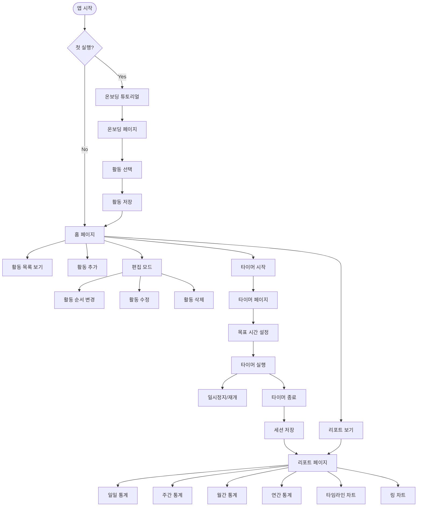
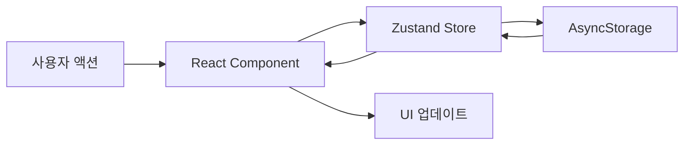

# Zen Tracker App 분석 문서

## 앱 개요
Zen Tracker는 사용자가 다양한 활동(읽기, 명상, 쓰기, 운동 등)에 집중한 시간을 추적하는 React Native 앱입니다. 사용자는 활동을 선택하고, 타이머를 시작하여 집중 시간을 기록하며, 일/주/월/년 단위로 통계를 확인할 수 있습니다.

## 기술 스택
- **프레임워크**: React Native (Expo)
- **상태 관리**: Zustand
- **내비게이션**: React Navigation
- **데이터 저장**: AsyncStorage (로컬 저장소)
- **주요 라이브러리**: 
  - date-fns (날짜 처리)
  - react-native-svg (차트 그래픽)
  - react-native-draggable-flatlist (드래그 앤 드롭)
  - react-native-circular-progress (원형 진행률)

## 앱 플로우차트



## 데이터베이스 구조 및 연동

### 데이터 저장 방식
이 앱은 **외부 데이터베이스를 사용하지 않고** AsyncStorage를 통한 **로컬 저장소**만 사용합니다. 모든 데이터는 디바이스에 로컬로 저장됩니다.

### 데이터 모델

#### 1. Activity (활동)
```typescript
interface Activity {
  id: string              // 고유 ID (timestamp + random)
  name: string           // 활동명
  totalTime: number      // 총 누적 시간 (밀리초)
  lastUsed: Date        // 마지막 사용 시간
  color?: string        // 활동 색상 (선택사항)
  order?: number        // 표시 순서
  sessions?: Session[]  // 세션 목록 (선택사항)
  lastTargetHours?: number    // 마지막 목표 시간
  lastTargetMinutes?: number  // 마지막 목표 분
}
```

#### 2. Session (세션)
```typescript
interface Session {
  id: string             // 세션 ID
  activityId: string     // 연결된 활동 ID
  startTime: Date       // 시작 시간
  endTime?: Date        // 종료 시간
  duration: number      // 지속 시간 (밀리초)
  pauses: Array<{       // 일시정지 기록
    start: Date
    end?: Date  
  }>
  targetDuration?: number // 목표 시간 (밀리초)
}
```

### 상태 관리 (Zustand Store)

#### 주요 상태
- `activities`: 모든 활동 목록
- `sessions`: 모든 세션 기록
- `currentSession`: 현재 진행 중인 세션
- `isFirstTime`: 첫 실행 여부
- `selectedActivities`: 선택된 활동 목록

#### 주요 액션
- `addActivity`: 새 활동 추가
- `removeActivity`: 활동 삭제
- `updateActivity`: 활동 정보 업데이트
- `reorderActivities`: 활동 순서 변경
- `startSession`: 세션 시작
- `pauseSession`: 세션 일시정지
- `resumeSession`: 세션 재개
- `endSession`: 세션 종료

### 데이터 영속성
Zustand의 `persist` 미들웨어를 사용하여 AsyncStorage에 자동으로 저장:
```javascript
persist(
  (set, get) => ({ ... }),
  {
    name: 'zen-storage',  // 저장소 키
    storage: createJSONStorage(() => AsyncStorage)
  }
)
```

## 주요 화면 및 기능

### 1. 온보딩 페이지 (OnboardingPage)
- **첫 실행 시** 표시
- 기본 활동 6개 제공 (읽기, 명상, 쓰기, 운동, 공부, 일)
- 사용자 정의 활동 추가 가능
- 선택된 활동들을 Store에 저장

### 2. 홈 페이지 (HomePage)
- **활동 목록 표시**: 각 활동의 오늘 집중 시간 표시
- **활동 관리**: 
  - 추가: 새 활동 생성
  - 편집: 활동명 수정
  - 삭제: 활동 제거
  - 순서 변경: 드래그 앤 드롭
- **빠른 액션**: 활동 탭하여 타이머 시작

### 3. 타이머 페이지 (TimerPage)
- **목표 시간 설정**: 시간/분 선택
- **타이머 기능**:
  - 시작/일시정지/재개
  - 진행률 원형 차트 표시
  - 목표 달성 시 시각적 피드백
- **백그라운드 타이머**: BackgroundTimer 서비스로 앱이 백그라운드에서도 정확한 시간 추적

### 4. 리포트 페이지 (ReportPage)
- **기간별 통계**: 일/주/월/년 단위
- **차트 뷰**:
  - Timeline Chart: 시간대별 활동 분포
  - Rings Chart: 활동별 비율
- **통계 정보**:
  - 총 집중 시간
  - 활동별 시간 및 비율
  - 평균 집중 시간
  - 최장 세션 시간

## 백그라운드 타이머 서비스
`BackgroundTimer` 클래스는 앱이 백그라운드 상태일 때도 정확한 시간을 추적합니다:

1. **AppState 모니터링**: 앱 상태 변화 감지 (active/background)
2. **백그라운드 시간 계산**: 백그라운드 진입 시간 기록
3. **복귀 시 보정**: 포그라운드 복귀 시 놓친 인터벌 실행
4. **정확한 경과 시간**: 일시정지 시간을 제외한 실제 활동 시간 계산

## 컴포넌트 구조

### 재사용 컴포넌트
1. **OnboardingTutorial**: 첫 사용자를 위한 튜토리얼
2. **RingsChart**: 활동별 비율을 보여주는 링 차트
3. **TimelineChart**: 시간대별 활동 분포 차트

### 유틸리티
- **activityColors**: 활동별 색상 관리

## 데이터 플로우



1. **사용자 액션**: 활동 추가, 타이머 시작 등
2. **컴포넌트에서 Store 액션 호출**: `useStore` 훅 사용
3. **Store 상태 업데이트**: Zustand가 상태 변경 관리
4. **AsyncStorage 자동 저장**: persist 미들웨어가 자동 처리
5. **UI 자동 업데이트**: Store 변경 시 구독된 컴포넌트 리렌더링

## 특징 및 장점

1. **오프라인 우선**: 모든 데이터가 로컬 저장되어 인터넷 연결 불필요
2. **실시간 동기화**: Zustand의 구독 메커니즘으로 즉각적인 UI 업데이트
3. **백그라운드 정확성**: 앱이 백그라운드에서도 정확한 시간 추적
4. **간단한 구조**: 외부 데이터베이스 없이 AsyncStorage만으로 구현
5. **사용자 프라이버시**: 모든 데이터가 디바이스에만 저장

## 향후 개선 가능 사항

1. **클라우드 동기화**: 여러 디바이스 간 데이터 동기화
2. **데이터 백업/복원**: 기기 변경 시 데이터 이전
3. **상세 분석**: 더 깊이 있는 통계 및 인사이트
4. **소셜 기능**: 친구와 활동 공유, 챌린지 기능
5. **알림 기능**: 목표 달성, 리마인더 등